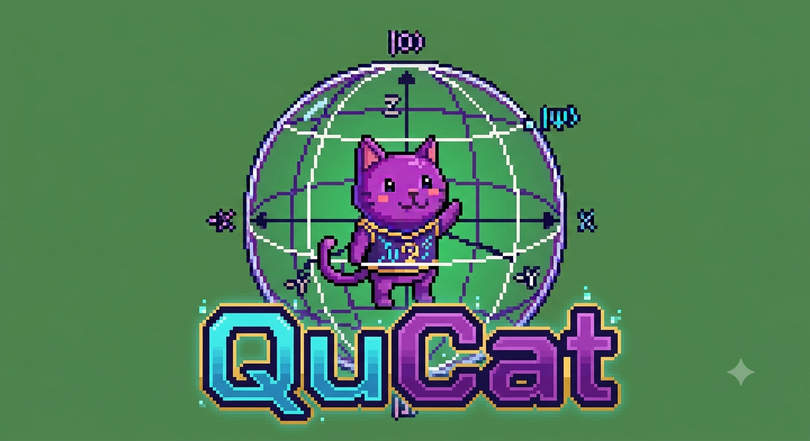

# QuCat 🐱: Videojuego para democratizar la computación cuántica (QHack 2026) ⚛️



## ❗ Problema Identificado

Existe una falta de democratización en la computación cuánticas, especialmente para niños y estudiantes de secundaria con pocos recursos y con poco conocimiento previo en física o matemáticas. Esto reduce el interés en áreas de la ciencia y la tecnología.

## 💡 Descripción de la solución

El producto de nuestro proyecto es el videojuego QuCat, una propuesta educativa diseñada para fomentar la democratización de la computación cuántica en un público joven, principalmente niños y adolescentes de secundaria, con bajos recursos y poco conocimiento sobre física y matemáticas.

En QuCat, el jugador controla a un gato dentro de una esfera de Bloch, la cual representa el estado de un qubit. El objetivo es recolectar las compuertas cuánticas que caen para modificar el estado del qubit y alcanzar el estado objetivo. Por ejemplo, el jugador puede comenzar en el estado $|0\rangle$ y necesitar colapsar a 1. Para lograrlo, debe combinar adecuadamente compuertas como H, X, Y, Z, S y T para aumentar la probabilidad de colapsar al estado correcto.

A través de esta mecánica, el jugador aprende de forma visual e interactiva cómo las compuertas cuánticas afectan el estado de un qubit, cómo se forma la superposición y cómo ocurre el colapso al medir el sistema. Además, el juego cuenta con una interfaz que permite visualizar el estado actual del qubit mediante las amplitudes de los estados $|0\rangle$ y $|1\rangle$, las probabilidades de colapsar en cada uno de ellos y el puntaje actual.

El sistema de juego está diseñado para reforzar estos conceptos de manera dinámica: el jugador obtiene 1 punto cuando logra colapsar al estado objetivo y pierde 1 punto si colapsa al estado contrario. Asimismo, gana cuando alcanza 5 puntos y pierde cuando llega a -5 puntos.

## 📂 Estructura de proyecto

```text
QuCat/
├── .github/
│   └── workflows/
│       └── deploy.yml                       # Flujo de CI/CD para desplegar automáticamente en GitHub Pages
├── .vscode/                                 # Configuración del entorno de VS Code
├── build/                                   # Salida generada por Pygbag con los archivos estáticos de la web
│   └── web/
├── img/                                     # Activos gráficos del juego (transparencias PNG preparadas)
│   ├── fondo.jpeg
│   ├── suelo.jpeg
│   ├── cat.png
│   ├── medidor.jpeg
│   ├── QuCatTitulo.png
│   ├── titulo_victoria.png
│   ├── titulo_derrota.png
│   └── compuerta_*.png / .jpeg              # Imágenes de las compuertas cuánticas
├── sfx/                                     # Efectos de sonido del videojuego
│   ├── get_gate.ogg
│   ├── pixel_jump_sound.ogg
│   ├── medicion.ogg
│   ├── victoria.ogg
│   └── game_over.ogg
├── web/                                     # Plantilla web personalizada para Pygbag
│   └── index.html                           # Estructura HTML5 y canvas ajustado a la pantalla
├── main.py                                  # Bucle principal del juego y flujo general
├── superposicion.py                         # Lógica cuántica para aplicar compuertas y colapsar el qubit
├── configuracion.py                         # Constantes globales del proyecto
├── assets.py                                # Carga y escalado optimizado de imágenes y sprites
├── ui.py                                    # Funciones de interfaz y paneles del menú/instrucciones
├── formato_qubit.py                         # Formateo del estado del qubit para mostrar amplitudes
├── pygbag.ini                               # Configuración de compilación WebAssembly/Pygbag
├── favicon.png                              # Ícono de la pestaña del navegador (logo de QuCat)
├── requirements.txt                         # Dependencias de Python del proyecto
├── README.md                                # Documentación del proyecto
├── LICENSE                                  # Licencia del repositorio
└── .gitignore                               # Archivos e historial de builds ignorados por Git
```

## 🔧 Requisitos

Este proyecto está desarrollado para ejecutarse localmente con:

- Python 3.11
- Conda (Miniconda o Anaconda)

### Dependencias principales

| Librería | Versión recomendada | Uso dentro del proyecto |
| --- | --- | --- |
| `pygame` | `>= 2.5.0` | Renderizar la ventana del videojuego, manejar eventos, sonidos, sprites e interfaz gráfica. |
| `qiskit` | `>= 1.0.0` | Modelar el comportamiento del qubit, aplicar compuertas cuánticas y simular el colapso de la medición. |
| `pygbag` | `>= 0.9.1` | Empaquetar y compilar el juego Python/Pygame a WebAssembly (WASM) para la web. |

### Instalación local

Puedes instalar el entorno con `pip` usando el archivo `requirements.txt`:

```bash
pip install -r requirements.txt
```

O creando un entorno dedicado en Conda:

```
conda create -n qucat python=3.11
conda activate qucat
pip install -r requirements.txt
```

## 🌐 Probar el juego en la Web

¡No necesitas instalar nada para jugar! QuCat está desplegado en línea gracias a WebAssembly y GitHub Pages.

👉 Juega QuCat en el siguiente link:

```text
https://aleon30.github.io/QuCat/
```

💡 Nota de ejecución:

Al cargar la página por primera vez, haz un clic sobre la pantalla para inicializar el contexto de audio del navegador y dar comienzo al juego.

## 🎥 Video Demo

```text
https://youtu.be/HgSh1QcNgJ8
```

## 📄 Disclaimer

Duplicado del repositorio original usado para la Hackathon:
```text
https://github.com/DarkSentinel24/Grupo1-HackatonQhubWinterS
```